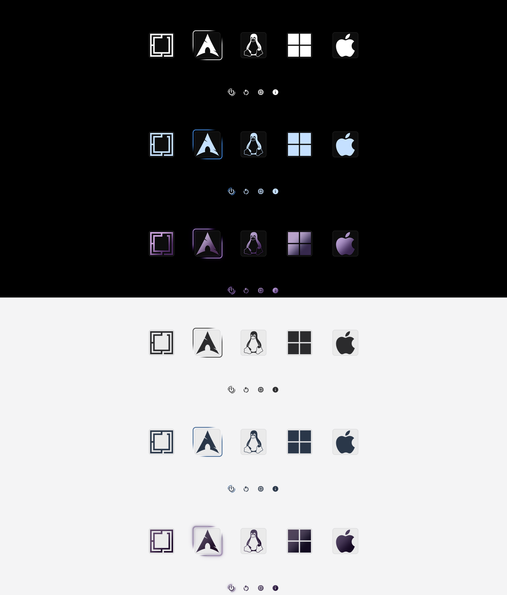
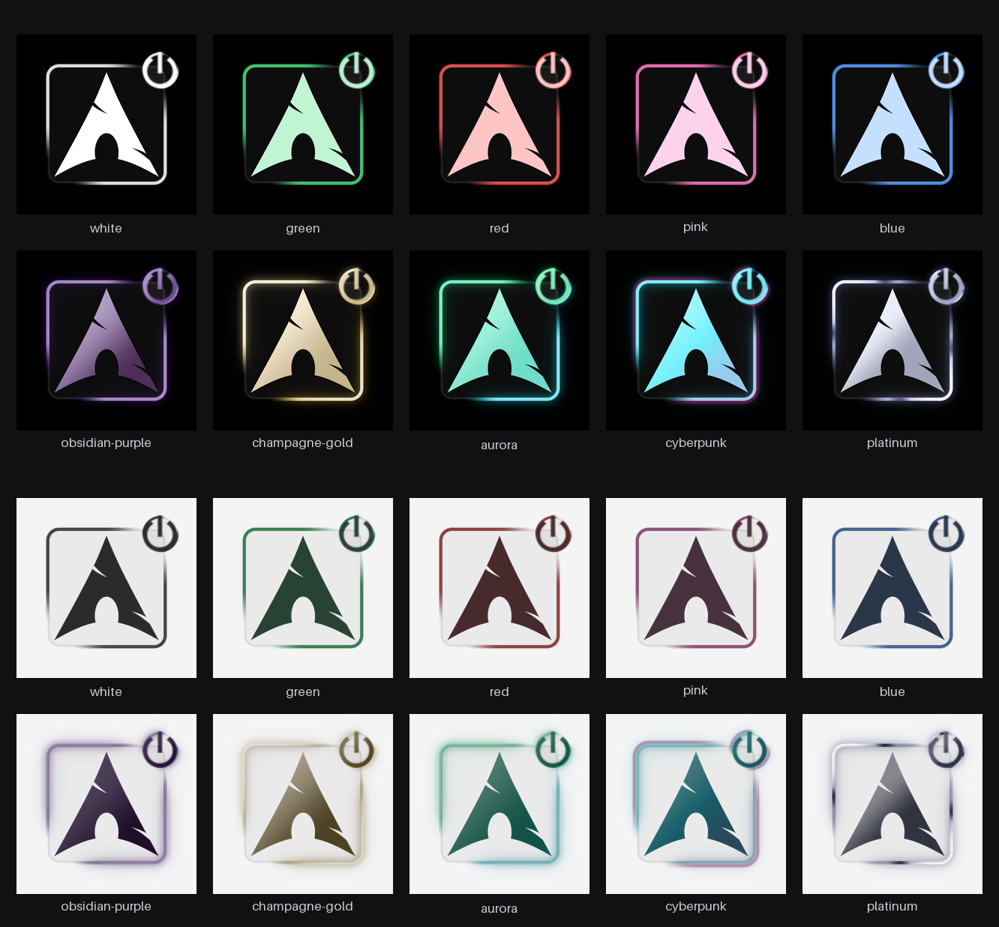

# Lumen — rEFInd Minimal Theme

A premium minimal [rEFInd](https://www.rodsbooks.com/refind/) theme focused on a clean, modern, and distraction-free boot experience.

Lumen combines monochrome OS icons, subtle glass cards, customizable colors, and a partial luminous selection effect — without labels, panels, or unnecessary UI elements.



## Features

- Minimal and distraction-free rEFInd interface
- Dark and light background variants
- 49 OS and utility icons
- Subtle rounded glass cards
- Neutral cards for unselected entries
- Partial luminous selection frame
- Selection light follows the rounded-square card perimeter
- Smoothly fading light segments and soft glow
- Standard colors and premium gradient variants
- Theme-colored icons
- Separate dark and light icon variants
- Local color generation
- Interactive color picker
- Generate only the colors you need
- Automatic generation of missing color assets
- Safe installation and color switching
- No modifications to boot entries or other bootloaders

## Preview

### Theme Overview



### rEFInd Boot Menu


## Installation

### Clone

```bash
git clone https://github.com/shoxjaxon-atabayev/refind-lumen.git
cd refind-lumen
```

### Choose a Color

Run the installer without arguments to open the interactive color picker:

```bash
./install.sh
```

Use:

- `↑ / ↓` — navigate
- `Space` — select or deselect
- `Enter` — generate and continue

Generated color assets are stored locally in:

```text
build/colors/
```

The generated assets are gitignored and are not included in the repository.

### Install a Color

Install a specific color directly:

```bash
./install.sh --color blue
```

For example:

```bash
./install.sh --color obsidian-purple
./install.sh --color champagne-gold
./install.sh --color aurora
./install.sh --color platinum
```

If the requested color has not been generated yet, the installer generates it automatically.

Reboot after installation to load the theme.

## Theme Colors

### Standard Colors

```text
white
green
red
pink
blue
obsidian-purple
champagne-gold
```

### Premium Gradients

```text
aurora
solaris
rose-gold
cyberpunk
platinum
```

The selected color is used consistently across the generated theme assets, including icons and selection graphics.

## Backgrounds

Lumen supports both dark and light backgrounds.

### Dark

```bash
./install.sh --background dark
```

### Light

```bash
./install.sh --background light
```

Color and background can also be selected together:

```bash
./install.sh --color platinum --background light
```

## Selection Effect

The selected entry is highlighted with a partial luminous frame that follows the rounded-square card perimeter.

Unlike a traditional continuous border, the luminous frame contains intentional gaps and smoothly fading endpoints.

The effect combines:

- Localized colored light
- Bright luminous segments
- Smooth fading endpoints
- Soft surrounding glow
- Dark gaps between illuminated sections
- Rounded-square geometry matching the card

The underlying card remains visible as a subtle neutral outline.

## Icons

Lumen includes 49 OS and utility icons covering a wide range of operating systems and rEFInd tools.

Icons are designed as clean monochrome silhouettes and receive a subtle tint based on the selected theme color.

The same icon system is available in both dark and light variants.

## Glass Cards

Each entry is placed inside a subtle rounded-square card.

Unselected entries use a restrained neutral appearance, keeping the interface visually quiet.

The selected entry retains the same card geometry while adding the colored luminous selection effect.

## Local Color Generation

Lumen does not store a pre-generated copy of every color in the repository.

Instead, the repository contains the source assets and generation system.

When a color is requested, Lumen generates the required assets locally:

```text
build/colors/<color>/
```

For example:

```text
build/colors/blue/
├── icons/
├── selection_big.png
├── selection_small.png
└── light/
    ├── icons/
    ├── selection_big.png
    └── selection_small.png
```

This approach keeps the repository lightweight while allowing every supported color to be generated on demand.

Generated assets are ignored by Git and can safely be deleted. The installer will regenerate missing assets when required.

## Useful Commands

### Interactive Installer

```bash
./install.sh
```

### Install a Color

```bash
./install.sh --color blue
```

### Select Background

```bash
./install.sh --background dark
./install.sh --background light
```

### List Available Options

```bash
./install.sh --list
```

### Dry Run

```bash
./install.sh --dry-run
```

### Skip Confirmation

```bash
./install.sh --yes
```

### Uninstall

```bash
./install.sh --uninstall
```

## Uninstall

Remove Lumen with:

```bash
./install.sh --uninstall
```

The installer restores the previous `refind.conf` state and removes the Lumen theme files installed on the EFI partition.

## Development

The main theme asset generator is:

```text
tools/generate.py
```

### Generate a Color

```bash
python3 tools/generate.py blue
```

### Generate Multiple Colors

```bash
python3 tools/generate.py blue red aurora
```

### List Colors

```bash
python3 tools/generate.py --list
```

### Generate to a Custom Directory

```bash
python3 tools/generate.py blue --out-dir=/tmp/lumen-blue
```

## Project Structure

```text
.
├── background.png
├── backgrounds/
│   ├── dark.png
│   └── light.png
├── icons/
├── install.sh
├── preview-menu.png
├── preview.png
├── selection_big.png
├── selection_small.png
├── theme.conf
└── tools/
    └── generate.py
```

Generated color assets are intentionally excluded from Git:

```text
build/colors/
```

## Requirements

- rEFInd
- Python 3
- Pillow
- NumPy

The installer checks the required dependencies before generating theme assets.

## Safety

The installer is designed to make only the changes required for Lumen.

It:

- Creates a backup of `refind.conf`
- Modifies only the Lumen-related configuration
- Does not modify boot entries
- Does not modify other bootloaders
- Does not modify Secure Boot configuration
- Does not remove operating systems

## Manual Installation

If you prefer to generate and install the theme manually, generate the required color first:

```bash
python3 tools/generate.py blue --out-dir=/tmp/lumen-blue
```

Then copy the generated theme assets into the appropriate rEFInd themes directory.

The theme can be enabled from `refind.conf` with:

```text
include themes/lumen/theme.conf
```

## License

Lumen is licensed under the MIT License.

Copyright (c) 2026 Shoxjaxon Atabayev.

Third-party asset attribution: see [NOTICE](NOTICE).
